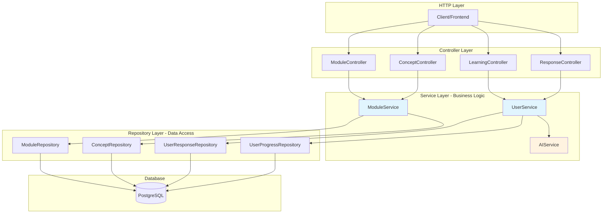

# BookAction Backend Architecture Design v2.0
**Document Type:** Technical Architecture Specification  
**Version:** 2.0  
**Date:** November 2025  
**Author:** Dako  

---

## Executive Summary

BookAction's backend is being refactored from a functional MVP to a production-grade, object-oriented architecture. This redesign introduces industry-standard patterns including Domain-Driven Design (DDD), Repository Pattern, and Dependency Injection, positioning the system for scalability and maintainability.

The new architecture supports our roadmap for AI integration, real-time collaboration, and multi-tenant deployment while maintaining backward compatibility with existing frontend clients.

---

## 1. System Architecture Overview




---

## 2. Core Design Patterns & Principles

### 2.1 Architectural Patterns

| Pattern | Purpose | Implementation |
|---------|---------|----------------|
| **Domain-Driven Design** | Organize code around business domains | ModuleService, UserService, LearningService |
| **Repository Pattern** | Abstract data access layer | Prisma wrapped in repository classes |
| **Dependency Injection** | Decouple dependencies, improve testability | Container-based DI with singleton services |
| **DTO Pattern** | Separate internal models from API contracts | Request/Response DTOs with mappers |
| **Service Layer** | Centralize business logic | Thin controllers, fat services |
| **Unit of Work** | Ensure data consistency | Transaction management in services |

### 2.2 SOLID Principles Application

- **Single Responsibility**: Each class has one reason to change
- **Open/Closed**: Services extensible via inheritance
- **Liskov Substitution**: Repository interfaces allow implementation swapping
- **Interface Segregation**: Focused interfaces per domain
- **Dependency Inversion**: High-level modules depend on abstractions

---

## 3. Layer Architecture

### 3.1 Controller Layer
**Responsibility:** HTTP handling, request/response management  
**Key Classes:** ModuleController, ConceptController, LearningController, ResponseController  
**Design Principle:** Controllers remain thin, delegating all business logic to services  

### 3.2 Service Layer
**Responsibility:** Business logic, orchestration, transaction management  
**Key Classes:** ModuleService, UserProgressService, LearningService, AIService  
**Design Principle:** Domain-focused services that encapsulate business rules  

### 3.3 Repository Layer
**Responsibility:** Data access abstraction  
**Key Classes:** ModuleRepository, UserProgressRepository, ConceptRepository  
**Design Principle:** Isolate Prisma ORM, return domain entities  

### 3.4 Data Transfer Objects (DTOs)
**Responsibility:** API contract definition  
**Types:** Request DTOs (input validation), Response DTOs (output shaping)  
**Design Principle:** Never expose database entities directly  

---

## 4. Domain Model Architecture

### 4.1 Module Domain
```
ModuleService
├── getModule()
├── getModuleTheme()
├── getModuleReflection()
└── getModuleComplete()

ConceptService
├── getConcept()
├── getConceptsByModule()
├── getConceptWithQuizzes()
└── getConceptSummary()
```

### 4.2 User Learning Domain
```
UserProgressService
├── submitQuizResponse()
├── submitReflection()
├── updateConceptProgress()
└── getModuleProgress()

LearningService (Orchestration)
├── getLearningHomepage()
├── getNextLearningStep()
├── calculateCompletionPercentage()
└── generateLearningPath()
```

---

## 5. Complete Project Structure

### 5.1 📁File System

```
BookAction_BackEnd/
├── .env                           # Environment variables
├── .env.example                   # Example environment variables
├── .gitignore                     # Git ignore rules
├── package.json                   # Dependencies and scripts
├── tsconfig.json                  # TypeScript configuration
├── README.md                      # Project documentation
├── api.rest                       # HTTP request testing file
│
├── docs/                          # Documentation
│
├── prisma/
│   ├── schema.prisma              # Database schema
│   ├── seed.ts                    # Database seeding script
│   └── migrations/                # Database migrations (auto-generated)
│       └── [timestamp]_init/
│           └── migration.sql
│
└── src/
    ├── app.ts                     # Express app setup and middleware
    ├── server.ts                  # Server startup (calls app.ts)
    ├── app.backup.ts              # Backup of original app.ts (temporary)
    │
    ├── config/                    # Configuration files
    │   ├── database.ts            # Database configuration
    │   ├── env.ts                 # Environment variable validation
    │   └── constants.ts           # App constants
    │
    ├── types/                     # TypeScript type definitions
    │   ├── express.d.ts           # Extend Express Request type
    │   └── index.ts               # Shared type definitions
    │
    ├── container/                 # Dependency Injection
    │   ├── Container.ts           # Main DI container
    │   └── index.ts              # Container initialization
    │
    ├── repositories/              # Data Access Layer
    │   ├── base/
    │   │   └── BaseRepository.ts # Abstract base repository
    │   ├── prismaClient.ts       # Singleton Prisma instance
    │   ├── ModuleRepository.ts   # Module data access
    │   ├── ConceptRepository.ts  # Concept data access
    │   ├── QuizRepository.ts     # Quiz data access
    │   ├── UserRepository.ts     # User data access (Phase 2)
    │   ├── UserProgressRepository.ts  # Progress tracking
    │   └── UserResponseRepository.ts  # User responses
    │
    ├── services/                  # Business Logic Layer
    │   ├── base/
    │   │   └── BaseService.ts    # Abstract base service
    │   ├── domain/                # Domain services
    │   │   ├── ModuleService.ts  # Module business logic
    │   │   ├── ConceptService.ts # Concept business logic
    │   │   ├── UserProgressService.ts  # Progress tracking logic
    │   │   ├── LearningService.ts      # Learning orchestration
    │   │   └── AuthService.ts    # Authentication (Phase 2)
    │   ├── external/              # External service integrations
    │   │   └── AIService.ts      # AI integration (Phase 3)
    │   └── utils/
    │       └── TransactionManager.ts   # Transaction utilities
    │
    ├── controllers/               # HTTP Request Handlers
    │   ├── base/
    │   │   └── BaseController.ts # Abstract base controller
    │   ├── ModuleController.ts   # /api/modules/* endpoints
    │   ├── ConceptController.ts  # /api/concepts/* endpoints
    │   ├── LearningController.ts # /api/users/*/learning endpoints
    │   ├── ResponseController.ts # /api/*/submit endpoints
    │   └── AuthController.ts     # /api/auth/* endpoints (Phase 2)
    │
    ├── dtos/                      # Data Transfer Objects
    │   ├── request/               # Input validation schemas
    │   │   ├── SubmitQuizDTO.ts
    │   │   ├── SubmitReflectionDTO.ts
    │   │   ├── LoginDTO.ts       # (Phase 2)
    │   │   └── RegisterDTO.ts    # (Phase 2)
    │   └── response/              # Output contracts
    │       ├── ModuleDTO.ts
    │       ├── ThemeDTO.ts
    │       ├── ConceptDTO.ts
    │       ├── QuizDTO.ts
    │       ├── QuizResultDTO.ts
    │       ├── LearningHomepageDTO.ts
    │       ├── ProgressDTO.ts
    │       └── AuthResponseDTO.ts # (Phase 2)
    │
    ├── mappers/                   # Entity to DTO conversion
    │   ├── base/
    │   │   └── BaseMapper.ts     # Abstract base mapper
    │   ├── ModuleMapper.ts       # Module entity → DTO
    │   ├── ThemeMapper.ts        # Theme entity → DTO
    │   ├── ConceptMapper.ts      # Concept entity → DTO
    │   ├── QuizMapper.ts         # Quiz entity → DTO
    │   └── ProgressMapper.ts     # Progress calculations → DTO
    │
    ├── middleware/                # Express Middleware
    │   ├── auth.middleware.ts    # JWT verification (Phase 2)
    │   ├── error.middleware.ts   # Global error handler
    │   ├── validation.middleware.ts  # Request validation
    │   ├── rateLimiter.middleware.ts # Rate limiting (Phase 4)
    │   ├── requestLogger.middleware.ts # Request logging
    │   └── tempAuth.middleware.ts    # Temporary auth (Phase 1)
    │
    ├── routes/                    # Route Definitions
    │   ├── index.ts              # Main router aggregator
    │   ├── module.routes.ts      # Module endpoints
    │   ├── concept.routes.ts     # Concept endpoints
    │   ├── learning.routes.ts    # Learning endpoints
    │   ├── response.routes.ts    # Response submission endpoints
    │   └── auth.routes.ts        # Auth endpoints (Phase 2)
    │
    ├── errors/                    # Error Classes
    │   ├── AppError.ts           # Base error class
    │   ├── NotFoundError.ts      # 404 errors
    │   ├── ValidationError.ts    # 400 validation errors
    │   ├── UnauthorizedError.ts  # 401 errors
    │   └── index.ts              # Error exports
    │
    ├── utils/                     # Utility Functions
    │   ├── logger.ts             # Winston/Pino logger setup
    │   ├── pagination.ts         # Pagination helpers
    │   ├── validators.ts         # Zod schemas
    │   └── helpers.ts            # General helpers
    │
    └── old_services/              # Temporary - old code reference
        └── LearnHomepage.ts       # Original service (delete after refactor)

tests/                             # Test files (Phase 4)
├── unit/
│   ├── services/
│   │   ├── ModuleService.test.ts
│   │   └── UserProgressService.test.ts
│   └── repositories/
│       └── ModuleRepository.test.ts
├── integration/
│   ├── module.test.ts
│   └── learning.test.ts
└── fixtures/
    └── testData.ts
```


### 5.2 Data Flow Through Layers

```
1. HTTP Request arrives
   ↓
2. Express Route matches URL
   ↓
3. Middleware validates/authenticates
   ↓
4. Controller receives request
   ↓
5. Controller calls Service method
   ↓
6. Service executes business logic
   ↓
7. Service calls Repository for data
   ↓
8. Repository queries database (Prisma)
   ↓
9. Entity returned to Service
   ↓
10. Service transforms to DTO (via Mapper)
    ↓
11. DTO returned to Controller
    ↓
12. Controller sends HTTP Response
```

---


## 9. Deployment Architecture

### 9.1 Deployment Strategy
```
Development → Staging → Production
    ↓           ↓           ↓
  Local      Render      Render
   Dev      (Staging)  (Production)
```

### 9.2 Infrastructure
- **Hosting:** Render (PaaS)
- **Database:** Render PostgreSQL
- **Monitoring:** DataDog / New Relic
- **CI/CD:** GitHub Actions
- **Container:** Docker-ready

---

