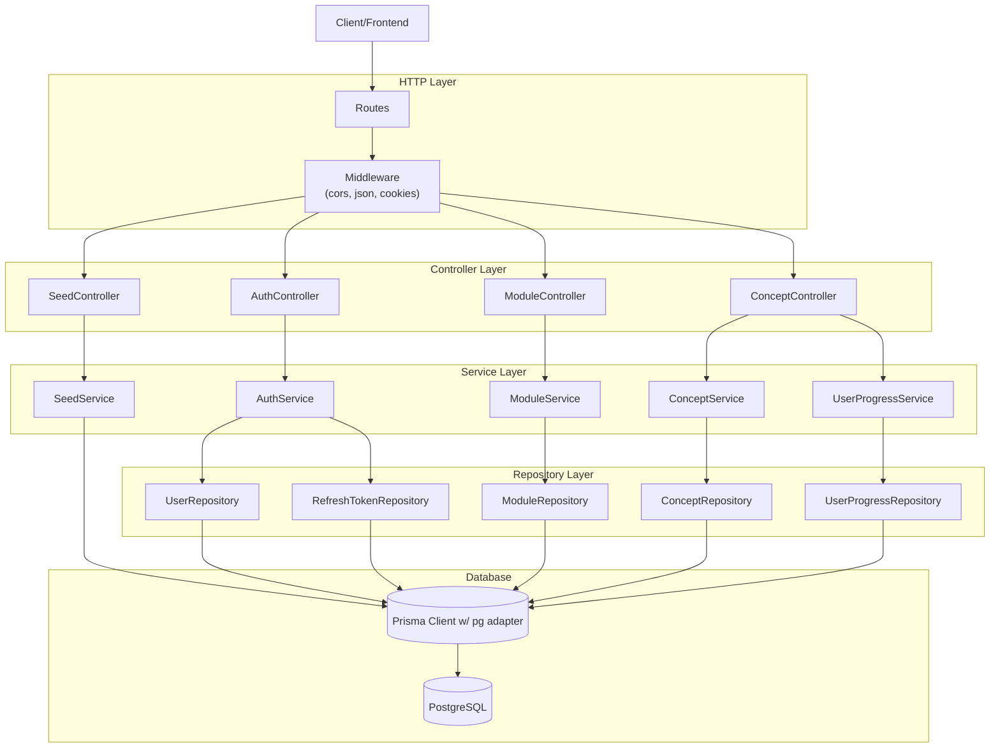

# BookAction Backend Architecture Design v2.0

**Document Type:** Technical Architecture Specification  
**Version:** 2.0 (updated)  
**Date:** March 2025  
**Author:** Dako

---

## Executive Summary

BookAction’s backend is a TypeScript/Express 5 service backed by PostgreSQL (via Prisma). The codebase uses a service/repository layering with explicit wiring in `src/app.ts` and a JWT-based authentication system (access + refresh tokens stored in cookies and persisted in the database). This document reflects the current implementation, with special focus on authentication.

---

## 1. System Architecture Overview



---

## 2. Core Design Patterns & Principles

| Pattern/Principle    | Purpose                                  | Implementation                                                                                  |
| -------------------- | ---------------------------------------- | ----------------------------------------------------------------------------------------------- |
| Service + Repository | Separate business logic from data access | `services/*` orchestrate; `repositories/*` wrap Prisma                                          |
| DTO Mapping          | Keep HTTP contracts stable               | DTOs in `dtos/request` and `dtos/response`                                                      |
| Input Validation     | Fail fast on bad input                   | Zod schemas in `validation/authValidation.ts`                                                   |
| AuthN/AuthZ          | Secure protected routes                  | JWT access tokens (Authorization header) + refresh tokens (httpOnly cookie) with DB persistence |
| Error Handling       | Consistent auth errors                   | `AuthError` plus per-endpoint error responses                                                   |
| Layered Middleware   | Cross-cutting concerns                   | `cors`, `express.json`, `cookie-parser`, `authMiddleware` on protected routers                  |

---

## 3. Layer Architecture (Current)

### 3.1 Routing & Middleware

- `src/app.ts` wires Express, CORS, JSON parsing, cookie parsing, static media, and registers routes.
- `src/routes/*` define domain routers; `authMiddleware` is applied at the router level for protected resources.
- `src/middleware/authMiddleware.ts` verifies access tokens from `Authorization: Bearer <token>` and attaches `req.user`; `roleRequire` helper is available for role checks (not yet applied).

### 3.2 Controllers

- `controller/AuthController.ts` – register, login, refresh, logout, current user.
- `controller/ModuleController.ts` – module theme, reflections (get/save), modules overview.
- `controller/ConceptController.ts` – tutorial, quizzes, summary, quiz submission, progress update.
- `controller/SeedController.ts` – protected seed endpoint guarded by env token.

Controllers remain thin: parse/validate, delegate to services, shape responses.

### 3.3 Services

- `AuthService` – password hashing, token issuance/verification, refresh rotation, logout, user lookup.
- `ModuleService` – theme retrieval, modules overview with user progress, reflections CRUD.
- `ConceptService` – tutorials, quizzes, summaries, quiz scoring/persistence.
- `UserProgressService` – upsert concept completion/time tracking.
- `SeedService` – runs Prisma seed script when enabled.

### 3.4 Repositories (Prisma-backed)

- `UserRepository`, `RefreshTokenRepository`, `ModuleRepository`, `ConceptRepository`, `UserProgressRepository`.
- Use `lib/prisma.ts` which configures Prisma with `@prisma/adapter-pg` and `pg` pool, with dev-mode global reuse.

### 3.5 Data Contracts

- Request DTOs: `dtos/request/*` (e.g., `AutheticationDTO.ts`, `AnswerToQuizDTO.ts`, `UpdateProgressDTO.ts`, `ReflectionDTO.ts`).
- Response DTOs: `dtos/response/*` (e.g., `UserInfoDTO.ts`, `ModulesOverviewDTO.ts`, `ConceptTutorialDTO.ts`, `ConceptQuizzesDTO.ts`, `ConceptSummaryDTO.ts`, `ModuleThemeDTO.ts`).

---

## 4. Authentication Architecture

**Token model**

- Access token: JWT signed with `JWT_ACCESS_SECRET`, expiry from `JWT_ACCESS_EXPIRY` (default `15min`). Sent by clients in `Authorization: Bearer <accessToken>`.
- Access payload: `{ userId, email, username, role }` (type `JWTPayload`).
- Refresh token: JWT signed with `JWT_REFRESH_SECRET`, expiry from `JWT_REFRESH_EXPIRY` (default `7d`). Stored server-side in `refresh_token` table and set as httpOnly cookie `refreshToken` (secure in production, `sameSite=strict`).

**Flows & endpoints (`routes/auth.routes.ts`)**

- `POST /api/auth/register` – validate (zod), hash password with bcrypt (`BCRYPT_SALT_ROUNDS`), create user, issue tokens, set refresh cookie, return access token + user DTO.
- `POST /api/auth/login` – validate, email/username lookup, password compare, last login update, issue tokens, set refresh cookie.
- `POST /api/auth/refresh` – accepts refresh token (cookie or body), validates against DB, returns new access token.
- `POST /api/auth/logout` – requires auth middleware; deletes refresh token from DB and clears cookie.
- `GET /api/auth/me` – requires auth middleware; returns current user DTO.

**Middleware**

- `authMiddleware` validates access token, attaches `req.user`, returns 401 on missing/invalid/expired token.
- `roleRequire` is available for role-based authorization (not yet wired to routes).

**Data persistence**

- `RefreshTokenRepository` creates, finds (with expiry check), deletes tokens, and can clean up expired/all-user tokens.
- `UserRepository` handles lookups and login timestamp updates.

**Security notes**

- Secrets must be present: `JWT_ACCESS_SECRET`, `JWT_REFRESH_SECRET`; service throws on missing configuration.
- Cookies are httpOnly and secure in production; CORS allows origins `http://localhost:3002` and `http://localhost:3000` with credentials.
- Tokens are rotated per login; `jti` is added to refresh tokens to allow multiple sessions per user.

---

## 5. Domain Model & Data Layer (Prisma `schema.prisma`)

- **Learning content**
  - `Module` (1) → `Theme` (1), `Concept` (many), `Reflection` (many per user)
  - `Concept` → `Tutorial` (1), `Summary` (1), `Quiz` (many), `User_concept_progress` (many per user)
  - `Quiz` stores `options` (JSON), `correct_option_index` (int array), `question_type` (single/multi-choice)
  - `Reflection` stores prompt/media and links to `User_response`
- **User activity**
  - `User_concept_progress` – completion/time per concept per user (composite unique)
  - `User_response` – quiz answers or reflection text; keeps full submission history
- **Identity**
  - `User` with enum `UserRole` (STUDENT/TEACHER/ADMIN), active flag, timestamps
  - `RefreshToken` with expiry and unique token per record

---

## 6. Project Structure (key files)

```
src/
  app.ts                 # Express setup and wiring
  server.ts              # Server bootstrap
  lib/prisma.ts          # Prisma client with pg adapter
  controller/            # Auth, Module, Concept, Seed controllers
  services/              # Auth, Module, Concept, UserProgress, Seed services
  repositories/          # User, RefreshToken, Module, Concept, UserProgress
  routes/                # auth.routes.ts, module.routes.ts, concept.routes.ts, seed.routes.ts
  middleware/            # authMiddleware
  dtos/request|response  # DTO contracts
  constants/             # responseTypes, userRoleTypes
  utils/errors.ts        # AuthError
prisma/schema.prisma     # PostgreSQL schema
public/media             # Static media served under /media
```

---

## 7. Data & Control Flow (runtime)

1. HTTP request hits Express route.
2. Router applies `authMiddleware` where protected (modules, concepts, logout, /me).
3. Controller parses/validates input (Zod for auth), delegates to service.
4. Service orchestrates logic, calls repository for DB access (Prisma).
5. Repository queries Postgres and returns domain data.
6. Service maps to DTOs; controller sends JSON response (sets/clears cookies for auth flows).

---

## 8. Deployment & Operations

- **Hosting:** Render-ready; Docker support via `docker-compose.yml`.
- **Database:** PostgreSQL; Prisma migrations supported (`npm run prisma:migrate` / `prisma:migrate:deploy`).
- **Secrets:** `DATABASE_URL`, `JWT_ACCESS_SECRET`, `JWT_REFRESH_SECRET`, `JWT_ACCESS_EXPIRY`, `JWT_REFRESH_EXPIRY`, `BCRYPT_SALT_ROUNDS`, `ENABLE_SEED_ENDPOINT`, `SEED_ENDPOINT_TOKEN`.
- **Static assets:** Served from `public/media` via `/media`.
- **CI/CD:** GitHub Actions-ready (build + migrate + start).

---

## 9. Authentication Checklist (operational)

- Set both JWT secrets and expiries in all environments.
- Serve over HTTPS so refresh cookies remain secure.
- Allowlisted CORS origins must align with frontend hosts; update `cors` config as needed.
- Run periodic cleanup of expired refresh tokens (`RefreshTokenRepository.deleteExpiredTokens`) if DB growth becomes an issue.
